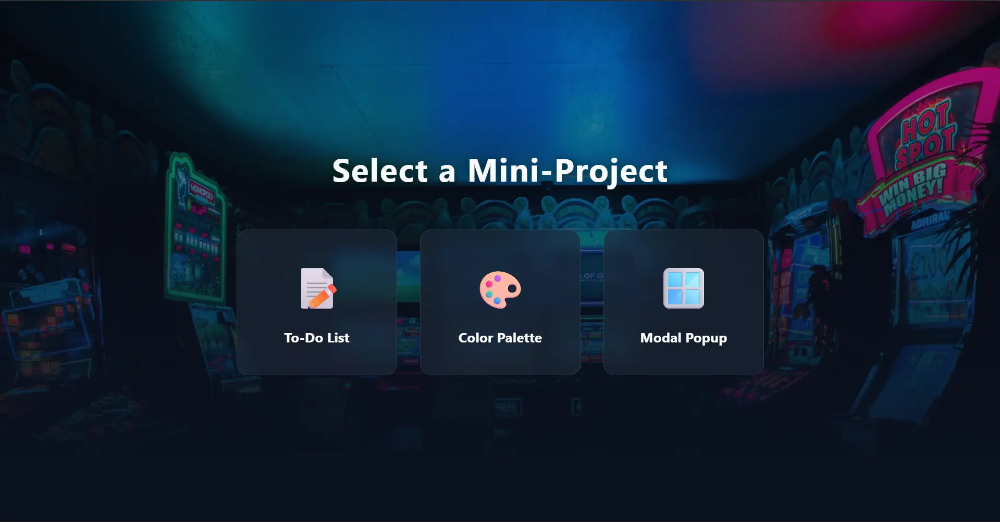

# 🚀 Mini-Projects Dashboard




👉 **[Click here to view the Live Demo](https://stevenashrafkamal.github.io/3-JS-Projects/)**


## 📌 About The Project

This repository contains my college project, which I have successfully designed, developed, and fully completed from scratch. 

The project is a modern, interactive **Mini-Projects Dashboard** built entirely with Vanilla JavaScript, HTML, and CSS. It serves as a practical demonstration of core front-end development concepts, including DOM manipulation, array methods, Event Listeners, and modern UI/UX design principles.

## ✨ Features & Applications

The dashboard navigates seamlessly between three main applications using a Single Page Application (SPA) approach:

1. **📝 To-Do List App**
   * Full CRUD operations (Create, Read, Update, Delete).
   * Dynamic task rendering using JavaScript arrays.
   * Clean and intuitive task management interface.

2. **🎨 Color Palette Generator**
   * Generates a grid of 8 random HEX colors on demand.
   * **Click-to-Copy:** Integrated with the Browser's Clipboard API to easily copy HEX codes.
   * Interactive hover effects illuminating the entire color card.

3. **🪟 Modal Popup**
   * Clean implementation of a modal window.
   * Demonstrates state management (open/close states) and event handling (closing via button or clicking outside the overlay).

## 🎨 UI/UX Highlights

* **Dynamic Backgrounds:** High-quality background images blended with dark gradients for each specific app section.
* **Glassmorphism Design:** Semi-transparent cards with background blur (`backdrop-filter`) for a modern look.
* **Smooth Animations:** Fluid transitions, hover scaling effects, and fade-in animations for section navigation.
* **Responsive Layout:** CSS Grid and Flexbox implementations ensuring the apps look great on all screen sizes.

## 🛠️ Technologies Used

* **HTML5:** Semantic structuring.
* **CSS3:** Custom properties (variables), Grid, Flexbox, Keyframes, and Glassmorphism effects.
* **JavaScript (ES6+):** Arrow functions, DOM manipulation, Array methods (`map`, `filter`, `forEach`), and the Clipboard API. No external libraries or frameworks were used.

## 📁 Project Structure
```text
📦 Mini-Projects-Dashboard
 ┣ 📜 index.html    # The main HTML structure
 ┣ 📜 style.css     # All styling and animations
 ┗ 📜 script.js     # The application logic and routing
```
## 🚀 Live Demo & How to Run

### 🌍 Live Preview
You can easily try out the mini-projects live without downloading anything!  
👉 **[Click here to view the Live Demo](https://stevenashrafkamal.github.io/3-JS-Projects/)**

### 💻 Run Locally
If you want to explore the code or run it on your machine, no installation or build processes are required since it uses Vanilla web technologies:

1. Clone the repository:
   ```bash
   git clone [https://github.com/stevenashrafkamal/3-JS-Projects.git](https://github.com/stevenashrafkamal/3-JS-Projects.git)
2. Navigate to the project folder.

3. Simply open index.html in any modern web browser.

## 👤 Author:
Steven Ashraf Kamal

Computer Science Student, Minya University
